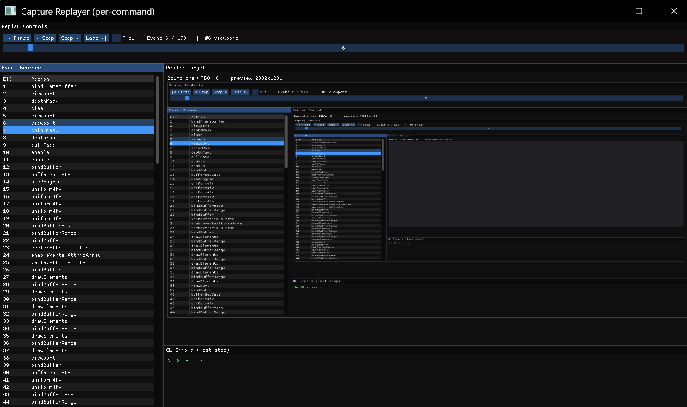

# State swap
## Main goal
### Problem Description
- 在使用drawCommandsGLlib时，状态恢复函数会将状态恢复，由于OpenGL全局共享状态，此时如果使用ImGui来充当图形界面，ImGui在帧上的操作会改变状态导致Error
    - 如图，使用ImGui绘制时，重放命令执行时在经由ImGui修改的状态上操作导致回放Viewer直接显示了程序的截图
    
### Goal
- 防止使用ImGui重放帧时误将GUI程序的状态和重放所用状态混淆
## Design
使用一个状态管理器GLStateManager:
`/app/glStateManager` 
其中